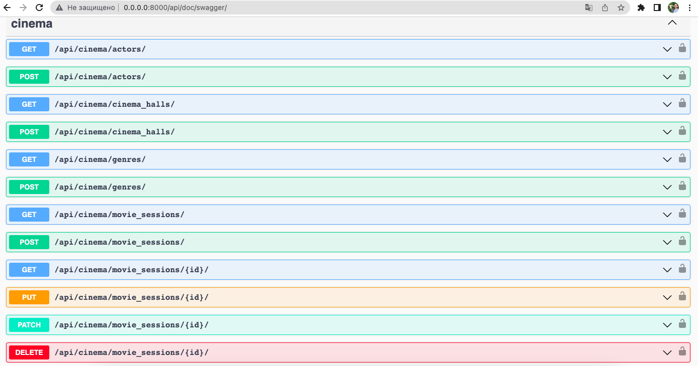
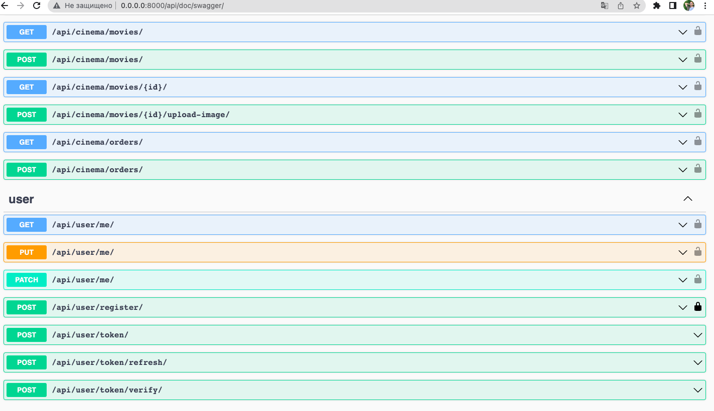

## Cinema API
API written on DRF for cinema management

## Installing using GitHub
Install PostgreSQL and create db

```angular2html
git clone https://git@github.com:ostapT/DRF-cinema-API.git
cd DRF-cinema-API
python -m venv venv
source venv/bin/activate (on MacOS/Linux)
venv\Scripts\activate (on Windows)
pip install -r requirements.txt
export DB_HOST=<your db hostname>
export DB_NAME=<your db name>
export DB_USER=<your db user>
export DB_PASSWORD=<your db password>
export SECRET_KEY=<your secret key>
python manage.py migrate
python manage.py runserver
```

## Run with Docker
Docker should be installed
```angular2html
docker-compose build
docker-compose up
```

## To get access to work with api do next steps

```angular2html
create user via /api/user/register/
get access token via /api/user/token/
```

## Features

- JWT authenticated
- Admin panel /admin/
- Documentation is located at /api/doc/swagger/
- Managing orders and tickets
- Creating movies with genres, actors
- Creating cinema halls
- Adding movie sessions
- Filtering movies and movie sessions

## Endpoints

